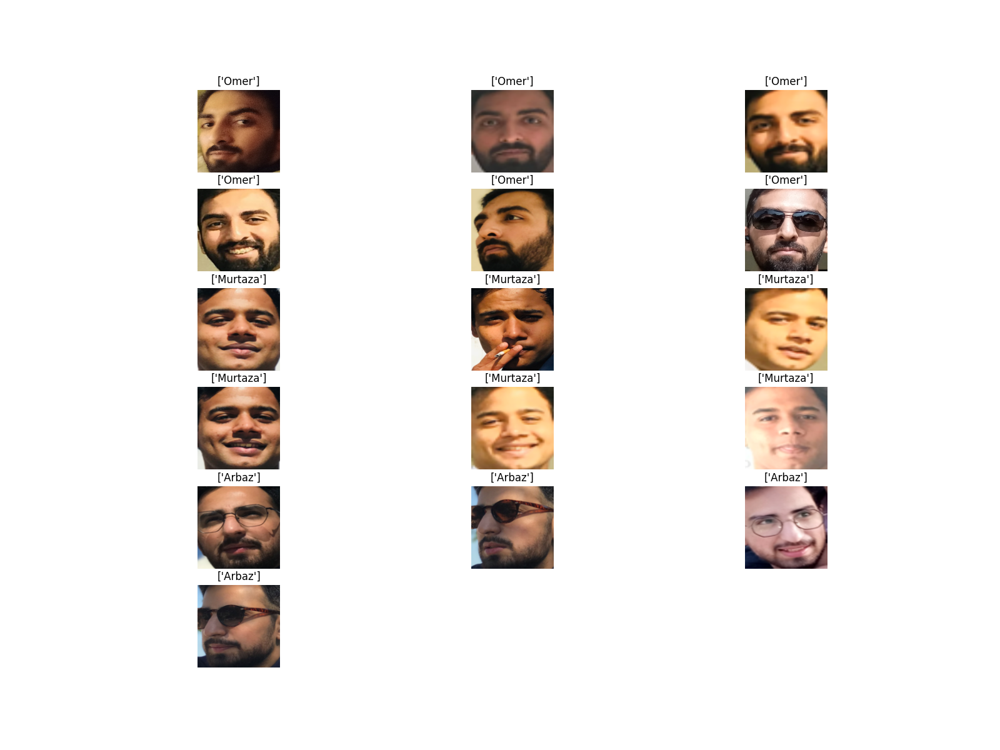

# Facial Localization and Recognition Model

This project implements a facial localization and recognition model using MTCNN (Multi-task Cascaded Convolutional Networks), FaceNet, and SVC (Support Vector Classifier).

## MTCNN (Multi-task Cascaded Convolutional Networks)

MTCNN is a deep learning-based algorithm that detects faces and facial landmarks. It consists of three stages: face detection, landmark localization, and bounding box regression. In this project, MTCNN is utilized for accurately localizing faces within images.

## FaceNet

FaceNet is a deep convolutional neural network designed to directly optimize the embedding of faces into a compact Euclidean space where distances directly correspond to a measure of face similarity. It produces a vector representation (embedding) of faces, which is used for face recognition tasks.

## SVC (Support Vector Classifier)

SVC is a supervised learning algorithm that is used for classification tasks. In this project, SVC is employed for face recognition. It takes the embeddings generated by FaceNet as input and trains a classifier to recognize individuals based on their facial features.

